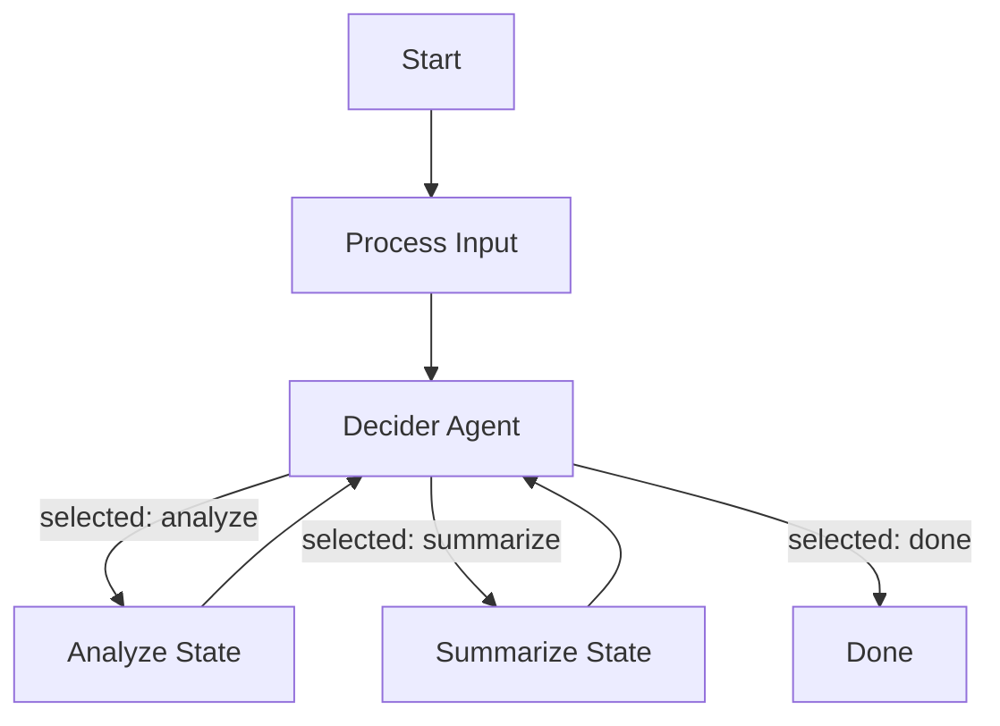

# Decider Agent Pattern (LLM Router)

A strategy for using an LLM agent to dynamically select the next state in a FlatMachine HSM.

## Concept

A "Decider Agent" is an LLM-based controller that selects the next state from a set of allowed transitions. This enables dynamic routing without hardcoded conditions, allowing the LLM to reason about the best path based on context.

## Architecture



## Implementation Approach

**No spec changes required.** Use `on_transition` hook to override routing:

1. **`decider` agent**: FlatAgent with structured output `{next_state: str, reasoning: str}`
2. **`DeciderHooks` class**: Overrides `on_transition()` to:
   - Call decider agent with current context
   - Return the selected next state
3. **Allowed states validation**: Hooks validate `next_state` is in allowed set from config

## Decider Agent Configuration

```yaml
# config/decider.yml
spec: flatagent
spec_version: "0.6.0"

data:
  name: decider
  model:
    name: gpt-4o-mini
    temperature: 0.3
  
  system: |
    You are a workflow controller. Based on the current context,
    decide which state should be executed next.
    
    Available states: {{ input.allowed_states | join(", ") }}
    
    Consider the goal and current progress to make your decision.
    Think about:
    - What has been accomplished so far
    - What still needs to be done
    - Which state would make the most progress toward the goal
  
  user: |
    Goal: {{ input.goal }}
    Current context: {{ input.context | tojson }}
    Last state: {{ input.last_state }}
    
    Which state should run next?
  
  output:
    next_state:
      type: str
      description: "The name of the next state to execute"
    reasoning:
      type: str
      description: "Brief explanation of why this state was chosen"
```

## Hooks Implementation

```python
from typing import Any, Dict, List, Optional
from flatagents import MachineHooks, FlatAgent, get_logger
import asyncio

logger = get_logger(__name__)


class DeciderHooks(MachineHooks):
    """
    Hooks that use an LLM agent to decide the next state.
    
    The decider agent is called on each transition to select
    the next state from a set of allowed options.
    """
    
    def __init__(
        self,
        decider_config: str,
        allowed_states: List[str],
        goal: str,
        decision_states: Optional[List[str]] = None
    ):
        """
        Args:
            decider_config: Path to the decider agent config file
            allowed_states: List of states the decider can choose from
            goal: The high-level goal to accomplish
            decision_states: States where decisions should be made.
                            If None, decisions are made at every transition.
        """
        self.decider = FlatAgent(config_file=decider_config)
        self.allowed_states = allowed_states
        self.goal = goal
        self.decision_states = set(decision_states) if decision_states else None
        self.decisions: List[Dict[str, Any]] = []
    
    def on_transition(
        self,
        from_state: str,
        to_state: str,
        context: Dict[str, Any]
    ) -> str:
        """Override transition target using decider agent."""
        # Skip if transitioning to/from terminal states
        if to_state in ["done", "error", "failed"]:
            return to_state
        
        # Skip if not a decision point
        if self.decision_states and from_state not in self.decision_states:
            return to_state
        
        # Call decider agent synchronously
        try:
            result = asyncio.get_event_loop().run_until_complete(
                self.decider.call(
                    allowed_states=self.allowed_states,
                    goal=self.goal,
                    context=context,
                    last_state=from_state
                )
            )
        except RuntimeError:
            # No event loop running, create one
            result = asyncio.run(
                self.decider.call(
                    allowed_states=self.allowed_states,
                    goal=self.goal,
                    context=context,
                    last_state=from_state
                )
            )
        
        selected = result.output.get("next_state", to_state)
        reasoning = result.output.get("reasoning", "")
        
        # Record decision for analysis
        self.decisions.append({
            "from_state": from_state,
            "default_to": to_state,
            "selected": selected,
            "reasoning": reasoning,
        })
        
        # Validate selection
        if selected not in self.allowed_states:
            logger.warning(
                f"Decider selected invalid state: {selected}. "
                f"Falling back to: {to_state}"
            )
            return to_state
        
        logger.info(f"Decider: {from_state} -> {selected} (reason: {reasoning})")
        return selected
    
    def get_decisions(self) -> List[Dict[str, Any]]:
        """Return all recorded decisions for analysis."""
        return self.decisions.copy()
```

## Example: Adaptive Customer Support Router

### Structure

```
sdk/python/examples/adaptive_router/
├── config/
│   ├── machine.yml       # HSM with specialist states
│   ├── decider.yml       # LLM-based router
│   ├── billing.yml       # Billing specialist agent
│   ├── technical.yml     # Technical support agent
│   └── general.yml       # General inquiry agent
├── src/
│   └── adaptive_router/
│       ├── hooks.py      # DeciderHooks
│       └── main.py
├── run.sh
└── README.md
```

### Machine Configuration

```yaml
# config/machine.yml
spec: flatmachine
spec_version: "0.3.0"

data:
  name: adaptive-router
  
  context:
    query: "{{ input.query }}"
    customer_id: "{{ input.customer_id }}"
    conversation: []
    resolution: null
  
  agents:
    billing: ./billing.yml
    technical: ./technical.yml
    general: ./general.yml
  
  states:
    start:
      type: initial
      transitions:
        - to: route  # Decider intercepts this
    
    route:
      # Placeholder state - decider routes from here
      transitions:
        - to: billing
        - to: technical
        - to: general
    
    billing:
      agent: billing
      input:
        query: "{{ context.query }}"
        customer_id: "{{ context.customer_id }}"
        history: "{{ context.conversation }}"
      output_to_context:
        response: "{{ output.response }}"
        resolved: "{{ output.resolved }}"
        conversation: "{{ context.conversation + [{'role': 'billing', 'content': output.response}] }}"
      transitions:
        - condition: "context.resolved == true"
          to: done
        - to: route  # Back to decider for next step
    
    technical:
      agent: technical
      input:
        query: "{{ context.query }}"
        history: "{{ context.conversation }}"
      output_to_context:
        response: "{{ output.response }}"
        resolved: "{{ output.resolved }}"
        conversation: "{{ context.conversation + [{'role': 'technical', 'content': output.response}] }}"
      transitions:
        - condition: "context.resolved == true"
          to: done
        - to: route
    
    general:
      agent: general
      input:
        query: "{{ context.query }}"
        history: "{{ context.conversation }}"
      output_to_context:
        response: "{{ output.response }}"
        resolved: "{{ output.resolved }}"
        conversation: "{{ context.conversation + [{'role': 'general', 'content': output.response}] }}"
      transitions:
        - condition: "context.resolved == true"
          to: done
        - to: route
    
    done:
      type: final
      output:
        resolution: "{{ context.response }}"
        conversation: "{{ context.conversation }}"

metadata:
  description: "Adaptive customer support router using LLM decisions"
```

### Main Entry Point

```python
# src/adaptive_router/main.py
import asyncio
from flatagents import FlatMachine
from .hooks import DeciderHooks


async def main():
    # Configure decider hooks
    hooks = DeciderHooks(
        decider_config="./config/decider.yml",
        allowed_states=["billing", "technical", "general", "done"],
        goal="Resolve the customer's support query efficiently",
        decision_states=["route"]  # Only decide at routing points
    )
    
    # Create and run machine
    machine = FlatMachine(
        config_file="./config/machine.yml",
        hooks=hooks
    )
    
    result = await machine.execute({
        "query": "I was charged twice for my subscription last month",
        "customer_id": "cust_12345"
    })
    
    print("Resolution:", result["resolution"])
    print("\nDecision log:")
    for decision in hooks.get_decisions():
        print(f"  {decision['from_state']} -> {decision['selected']}")
        print(f"    Reason: {decision['reasoning']}")


if __name__ == "__main__":
    asyncio.run(main())
```

## Use Cases

1. **Customer Support Routing**: Route queries to appropriate specialist agents based on content analysis
2. **Research Workflows**: Decide whether to search, analyze, or synthesize based on current knowledge
3. **Multi-step Tasks**: Dynamically choose between expansion, refinement, or completion phases
4. **Adaptive Learning**: Route to different difficulty levels based on user performance

## Comparison with Static Transitions

| Aspect | Static Transitions | Decider Pattern |
|--------|-------------------|-----------------|
| **Routing Logic** | Hardcoded conditions | LLM reasoning |
| **Flexibility** | Fixed at design time | Adapts to context |
| **Explainability** | Condition expressions | Natural language reasoning |
| **Cost** | No additional LLM calls | One call per decision |
| **Latency** | Instant evaluation | LLM inference time |
| **Best For** | Deterministic workflows | Ambiguous routing decisions |

## Configuration Options

The `DeciderHooks` class supports several configuration options:

```python
hooks = DeciderHooks(
    # Required
    decider_config="./config/decider.yml",
    allowed_states=["state1", "state2", "state3"],
    goal="Accomplish the user's objective",
    
    # Optional
    decision_states=["route", "checkpoint"],  # Only decide at these states
    # If None, decisions are made at every transition
)
```

## Metrics & Observability

The hooks track all decisions for analysis:

```python
decisions = hooks.get_decisions()
# Returns: [
#   {
#     "from_state": "route",
#     "default_to": "billing",
#     "selected": "technical",
#     "reasoning": "Query mentions 'error code' suggesting a technical issue"
#   },
#   ...
# ]
```

This enables:
- Debugging routing decisions
- Analyzing decision patterns
- Training improved decider prompts
- Auditing for compliance
