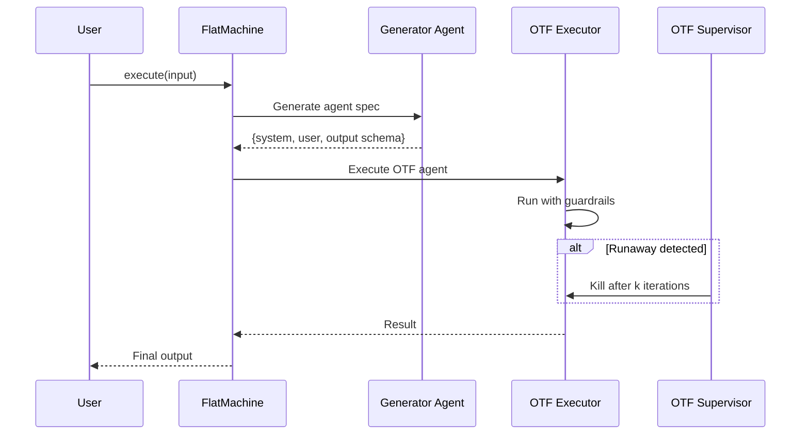

# On-The-Fly (OTF) Agent Pattern

A strategy for dynamically generating and executing agents at runtime within a FlatMachine HSM.

## Concept

An "OTF Agent" is an agent dynamically defined at runtime based on prior context. The HSM transitions to a synthetic "OTF execution" state that runs the generated agent, with guardrails to prevent runaway behavior.

## Architecture



## Implementation Approach

**No spec changes required.** Use hooks + custom execution type:

1. **`otf_generator` agent**: Standard flatagent that outputs an agent spec (system prompt, user prompt, output schema as JSON)
2. **`OTFExecutorHooks` class**: Custom hooks that:
   - Track OTF agent iterations (`context._otf_iterations`)
   - Kill runaway agents after `k` iterations
   - Validate OTF agent outputs against expected schema
3. **`otf_execute` action**: Hook action that creates and runs a `FlatAgent` from context data

## OTF Guardrails

| Guardrail | Implementation |
|-----------|----------------|
| **Max iterations** | `OTFExecutorHooks.on_state_enter()` checks `context._otf_iterations >= max_otf_iterations` |
| **Goal adherence** | Supervisor agent validates OTF output matches goal criteria |
| **Output schema enforcement** | OTF agent uses structured output; fallback to error state if invalid |
| **Time budget** | Execution timeout via `asyncio.timeout()` in hooks |

## OTF Metrics

```python
# Tracked by OTFExecutorHooks
otf_metrics = {
    "otf_agents_created": 0,
    "otf_iterations_total": 0,
    "otf_agents_killed": 0,  # Runaway count
    "otf_goal_violations": 0,
}
```

## Example Structure

```
sdk/python/examples/dynamic_agent/
├── config/
│   ├── machine.yml       # Main HSM with OTF states
│   ├── generator.yml     # Agent that generates agent specs
│   └── supervisor.yml    # Validates OTF outputs
├── src/
│   └── dynamic_agent/
│       ├── hooks.py      # OTFExecutorHooks
│       └── main.py
├── run.sh
└── README.md
```

## Use Case

Dynamic task decomposition where the generator agent creates specialized sub-agents based on the task. For example:

- A research agent that generates specialized "search agents" for different domains
- A coding agent that creates specialized "analyzer agents" for different languages
- A writing agent that generates "style agents" for different audiences

## Hooks Implementation

```python
from typing import Any, Dict, Optional
from flatagents import MachineHooks, FlatAgent, get_logger

logger = get_logger(__name__)


class OTFExecutorHooks(MachineHooks):
    """
    Hooks for On-The-Fly agent execution with guardrails.
    """
    
    def __init__(
        self,
        max_otf_iterations: int = 5,
        timeout_seconds: float = 30.0
    ):
        self.max_otf_iterations = max_otf_iterations
        self.timeout_seconds = timeout_seconds
        self.metrics = {
            "otf_agents_created": 0,
            "otf_iterations_total": 0,
            "otf_agents_killed": 0,
            "otf_goal_violations": 0,
        }
    
    def on_state_enter(self, state_name: str, context: Dict[str, Any]) -> Dict[str, Any]:
        """Check guardrails before OTF execution."""
        if state_name == "otf_execute":
            iterations = context.get("_otf_iterations", 0)
            if iterations >= self.max_otf_iterations:
                logger.warning(f"OTF agent killed after {iterations} iterations")
                self.metrics["otf_agents_killed"] += 1
                context["_otf_killed"] = True
        return context
    
    def on_action(self, action_name: str, context: Dict[str, Any]) -> Dict[str, Any]:
        """Execute OTF agent from context spec."""
        if action_name == "otf_execute":
            return self._execute_otf_agent(context)
        return context
    
    def _execute_otf_agent(self, context: Dict[str, Any]) -> Dict[str, Any]:
        """Create and execute an OTF agent from context."""
        if context.get("_otf_killed"):
            context["otf_result"] = {"error": "OTF agent killed due to runaway"}
            return context
        
        # Build inline agent config from context
        otf_spec = context.get("otf_agent_spec", {})
        agent_config = {
            "spec": "flatagent",
            "spec_version": "0.6.0",
            "data": {
                "name": "otf-agent",
                "model": otf_spec.get("model", {"name": "gpt-4o-mini"}),
                "system": otf_spec.get("system", "You are a helpful assistant."),
                "user": otf_spec.get("user", "{{ input.query }}"),
                "output": otf_spec.get("output", {}),
            }
        }
        
        try:
            agent = FlatAgent(config_dict=agent_config)
            import asyncio
            result = asyncio.run(agent.call(**context.get("otf_input", {})))
            
            self.metrics["otf_agents_created"] += 1
            self.metrics["otf_iterations_total"] += 1
            context["_otf_iterations"] = context.get("_otf_iterations", 0) + 1
            context["otf_result"] = result.output or {"content": result.content}
            
        except Exception as e:
            logger.error(f"OTF agent execution failed: {e}")
            context["otf_result"] = {"error": str(e)}
        
        return context
    
    def get_metrics(self) -> Dict[str, Any]:
        """Return collected metrics."""
        return self.metrics.copy()
```

## Machine Configuration

```yaml
spec: flatmachine
spec_version: "0.3.0"

data:
  name: dynamic-agent-example
  
  context:
    task: "{{ input.task }}"
    otf_agent_spec: null
    otf_result: null
    _otf_iterations: 0
  
  agents:
    generator: ./generator.yml
    supervisor: ./supervisor.yml
  
  states:
    start:
      type: initial
      transitions:
        - to: generate_agent
    
    generate_agent:
      agent: generator
      input:
        task: "{{ context.task }}"
      output_to_context:
        otf_agent_spec: "{{ output.agent_spec }}"
        otf_input: "{{ output.agent_input }}"
      transitions:
        - to: otf_execute
    
    otf_execute:
      action: otf_execute
      transitions:
        - condition: "context._otf_killed == true"
          to: error
        - to: supervise
    
    supervise:
      agent: supervisor
      input:
        task: "{{ context.task }}"
        result: "{{ context.otf_result }}"
      output_to_context:
        goal_met: "{{ output.goal_met }}"
        feedback: "{{ output.feedback }}"
      transitions:
        - condition: "context.goal_met == true"
          to: done
        - condition: "context._otf_iterations >= 5"
          to: error
        - to: generate_agent  # Loop with feedback
    
    done:
      type: final
      output:
        result: "{{ context.otf_result }}"
        iterations: "{{ context._otf_iterations }}"
    
    error:
      type: final
      output:
        error: "OTF execution failed or exceeded limits"
        iterations: "{{ context._otf_iterations }}"
```
